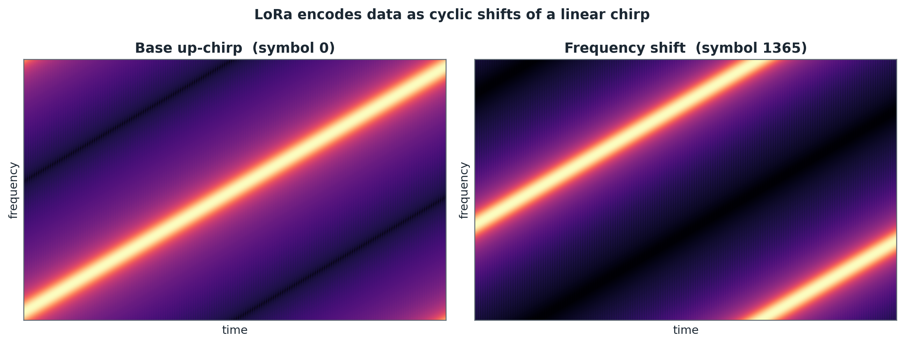
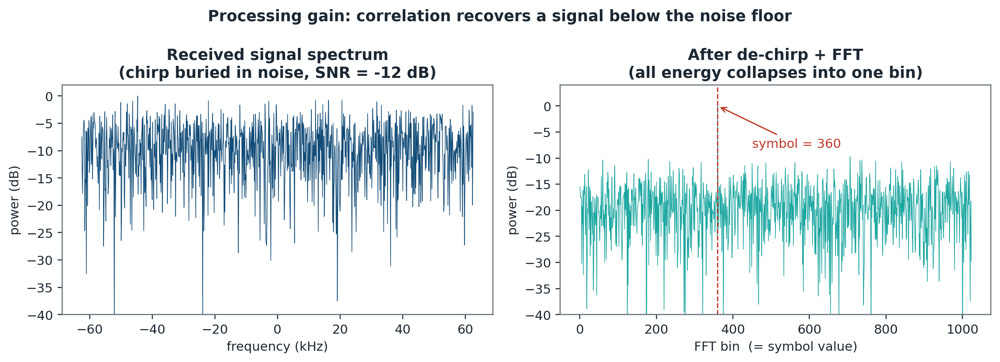
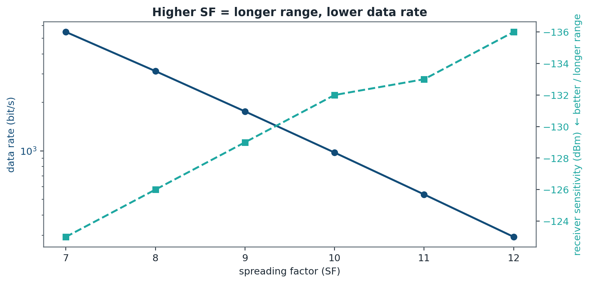

# Data Transmission System — Long-Range Chirp Communication

Off-grid, internet-free device-to-device messaging over **LoRa chirp spread
spectrum (CSS)** radio, built on a pair of **DX-LR02** modules. This repository
contains the host-side Python that pairs two modules, calibrates their link, and
sends data between them — plus an explanation of *why* chirp modulation is what
makes kilometre-scale links possible on milliwatt power budgets.

> Scope note: this is the **implemented DX-LR02 link**. The chirp modulation
> itself is performed inside the module's LoRa transceiver silicon; the code
> here drives that link over a UART. An SDR-based reimplementation (synthesizing
> and correlating the chirps in software between two radios) is a natural
> extension and is *not* included here.

---

## Why chirps? Chirp Spread Spectrum in one section

A **chirp** is a signal whose frequency sweeps linearly across a band over the
symbol time — an "up-chirp" ramps from `f_low` to `f_high`, a "down-chirp" does
the reverse. LoRa (the modulation the DX-LR02 uses) encodes data as **cyclic
shifts of a base chirp**: the starting frequency of the sweep selects one of
`2^SF` symbols, where `SF` is the *spreading factor*.



*A base up-chirp sweeps linearly across the band; a data symbol is the same
chirp shifted in frequency, wrapping modulo the bandwidth — the discontinuity's
position encodes the symbol value.*

This is the key to long range. Three properties fall out of it:

- **Processing gain.** Each symbol is spread across the full bandwidth `BW` for
  a long time `T = 2^SF / BW`. The receiver *de-chirps* (multiplies by a
  conjugate chirp) and FFTs, collapsing all that spread energy back into a
  single bin. Noise, which is *not* chirp-shaped, does not collapse — so the
  signal can be recovered **well below the noise floor** (LoRa works at SNR down
  to roughly −20 dB). Higher `SF` → more spreading → more range, at the cost of
  a lower data rate.
- **Robustness to interference and Doppler.** A linear sweep is hard to jam with
  a narrowband tone (the interferer only overlaps the sweep briefly) and is
  tolerant of frequency offset — a constant offset just shifts the correlation
  peak, it does not destroy it. That tolerance is also why two modules can talk
  even with imperfectly matched crystals.
- **Constant envelope.** The chirp is always full-amplitude (only its
  instantaneous frequency changes), so the transmitter's power amplifier runs at
  maximum efficiency — important on battery.



*Left: a symbol transmitted at −12 dB SNR is invisible in the raw received
spectrum. Right: after de-chirping and an FFT, the spreading gain (~30 dB for
SF 10) collapses all that energy into a single bin, well above the noise floor —
this is why LoRa decodes signals you cannot even see.*

The tradeoff is the classic spread-spectrum bargain: **range and reliability are
bought with data rate.** A high spreading factor reaches farther but sends fewer
bits per second. The DX-LR02 exposes this as its configurable *air rate*.



*As the spreading factor rises, the data rate drops (roughly halving per step)
while receiver sensitivity improves — buying range and link margin at the cost
of throughput.*

---

## The DX-LR02 module

The DX-LR02 is a USB dongle pairing a **LoRa transceiver** with a **CH340
USB-to-UART** bridge. By default it runs in **transparent mode**: bytes written
to the serial port are transmitted over the air as LoRa chirps, and bytes
received over the air appear on the paired module's serial port. No protocol,
no framing — a transparent serial cable that happens to be a radio link.

For two modules to talk they must share four settings: **frequency**, **air
rate** (spreading factor / bandwidth), **network ID**, and **address**. These
are normally set with the vendor's Windows tool or via AT commands in config
mode. On these particular dongles the **M0/M1 mode pins are not wired to the
CH340's DTR/RTS lines**, so config mode cannot be entered from software — a
hardware quirk that shapes everything in this repo (see
[read_config.py](read_config.py)).

---

## What this code does

The host never generates chirps — the module silicon does. The Python here is
the **link bring-up and application layer** on top of the transparent UART:
pairing verification, baud calibration, configuration probing, and messaging.

| File | Role |
|------|------|
| [lora_chat.py](lora_chat.py) | Application layer — send/receive/ping/interactive-chat between two modules on `/dev/ttyUSB0` and `/dev/ttyUSB1`. |
| [calibrate.py](calibrate.py) | Single-baud sweep — find the UART baud at which a known pattern survives a clean A→B→A round trip. |
| [calibrate_cross.py](calibrate_cross.py) | Cross-baud sweep — tries every `(TX baud, RX baud)` pair, for the case where the two modules were configured to different UART rates. |
| [read_config.py](read_config.py) | Configuration probe — sends every common Ebyte-binary and AT-style query at every baud and decodes any valid reply (addr / baud / parity / air-rate / channel). |

### Application layer — `lora_chat.py`

Opens both modules as 8-N-1 serial ports and offers four sub-commands:

```bash
python3 lora_chat.py test            # A→B then B→A ping, asserts both round-trip
python3 lora_chat.py chat            # interactive; prefix lines with 'A:' or 'B:'
python3 lora_chat.py send "hello" --from A
python3 lora_chat.py listen --on B
```

`chat` mode runs a reader thread per module so incoming air traffic prints as it
arrives while you type. `test` is the quickest go/no-go: if both pings round
trip, the pairing (freq / net ID / address) and antennas are good.

### Link calibration — `calibrate.py`, `calibrate_cross.py`

Because the modules can't be interrogated in software, the link's UART baud has
to be discovered empirically. Both scripts transmit a distinctive ASCII pattern
and score the received bytes by **printable-character ratio** plus exact match:

- `calibrate.py` assumes both modules share one baud (the factory default) and
  sweeps the eight DX-LR02-supported rates (1200 … 115200) looking for a clean
  round trip.
- `calibrate_cross.py` drops that assumption and sweeps the full
  `BAUD × BAUD` grid in both directions — the right tool when a previous config
  attempt left the two modules on mismatched rates.

### Configuration probe — `read_config.py`

Fires the common **Ebyte binary** commands (`C1 C1 C1` read-params,
`C3 C3 C3` read-version, the v2 `C1 00 06` variants) and **AT-style** queries
(`AT`, `AT+VER`, `AT+FRE?`, `AT+CH?`, …) at every baud, then decodes any valid
6-byte Ebyte reply (`C1 ADDH ADDL SPED CHAN OPTN`) into human-readable address,
UART baud, parity, air rate, and channel. If nothing replies at any baud, that
is itself the diagnosis: the module is **hard-wired in transparent mode** and
the commands are being aired over LoRa rather than interpreted locally —
re-configuration then requires the vendor tool or bridging M0/M1 to 3V3.

---

## Hardware setup

- 2 × DX-LR02 LoRa modules (CH340 USB-serial), one per host USB port.
- Antennas matched to the configured band (e.g. 433 / 868 / 915 MHz).
- Both modules pre-paired on identical frequency, air rate, network ID, address.
- Default wiring assumed: module **A** on `/dev/ttyUSB0`, module **B** on
  `/dev/ttyUSB1` (edit the `PORT_A` / `PORT_B` constants to match your system).

```
 host ──USB── [CH340|LoRa] ))) chirp spread spectrum ((( [LoRa|CH340] ──USB── host
   A          DX-LR02  #A          (long range, sub-GHz)        DX-LR02  #B          B
```

## Running

```bash
pip install pyserial
python3 read_config.py /dev/ttyUSB0     # inspect a module (or confirm transparent mode)
python3 calibrate.py                    # find the working UART baud
python3 lora_chat.py test               # verify the air link round-trips
python3 lora_chat.py chat               # talk
```

---

## Design themes

- **Right layer for the job.** The chirp PHY is solved in hardware; the
  interesting host-side problems are *bring-up* (what baud? are they paired?) and
  *application* (messaging). The code targets exactly those.
- **Empirical, defensive bring-up.** With config mode locked out, the link is
  characterized by measurement — sweeping bauds and scoring received bytes —
  rather than by trusting datasheet defaults.
- **Transparent-mode honesty.** A failed probe is treated as information: "no
  reply at any baud" is correctly interpreted as *hard-wired transparent mode*,
  not as a dead module.
